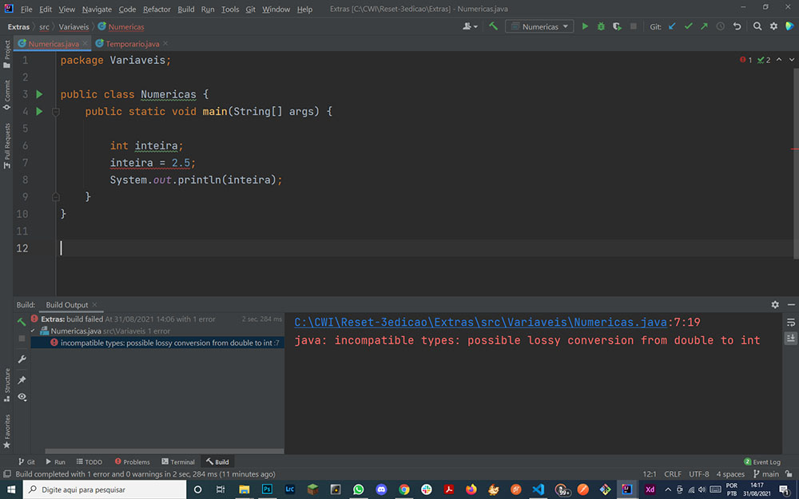
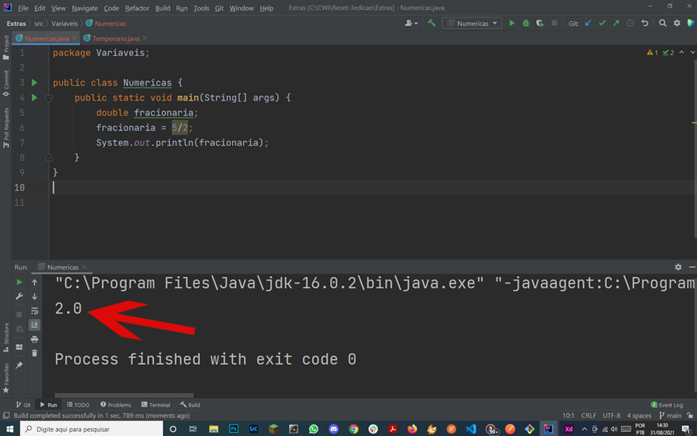
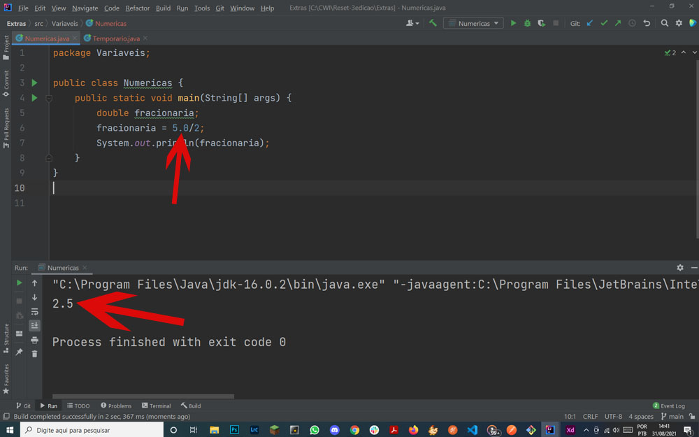

### Variáveis numéricas
Como já foi visto durante o curso, existe 6 tipos de variáveis númericas no java,sendo 4 inteiros `byte, short, int , long` e 2 fracionários `float e double`.

Então, como já vimos, se tentar atribuir um valor fracionário à um tipo inteiro, o código não irá compilar e irá indicar um erro.


Mas e o que será que acontece se tentarmos atribuir um resultado aritmético que não dá inteiro?

```java
public class Numericas {
    public static void main(String[] args) {

        int inteira;
        inteira = 5/2;
        System.out.println(inteira);
    }
}
```

Neste caso será possível compilar, no entanto o resultado não será `2.5` como esperado mas sim `2`. Isso nem  é por questão de arredondamento mas sim pq é considerado apenas o valor inteiro do resultado. Mesmo que a divisão desse `2.999999` o valor atribuiído à esta variável `inteira` seria `2`.

Ok, mas então para resolveir isso, ao invés de usar um tipo inteiro, deveria ser usado um que aceita fração certo?

```java
public class Numericas {
    public static void main(String[] args) {
        double fracionaria;
        fracionaria = 5/2;
        System.out.println(fracionaria);
    }
}
```

Mas aqui também o resultado não é o esperado. 



E para piorar ainda saiu `2.0` ao invés de `2.5`. 

### Pq isso acontece?
O fato é quando o Java vê a equação `5/2` ele entende que é um `Inteiro`/ `Inteiro`. Equações entre inteiros deve retornar um outro número inteiro. Ele faz esse cálculo antes de saber se a variável à qual vai ser atribuída é um inteiro ou fracionado.

### Mas e como resolver?
Para resolver isso, basta que algum dos números da equação não seja inteiro:
 

E se tentar fazer o mesmo com a variável Int?
```java
public class Numericas {
    public static void main(String[] args) {
        int inteira;
        inteira= 5.0/2;
        System.out.println(inteira);
    }
}
```
A IDE vai gritar e o código não irá compilar.


  

