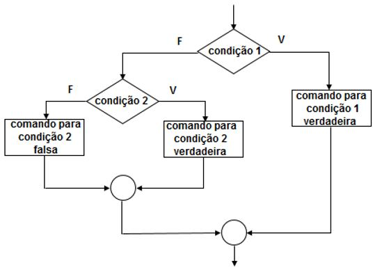

# Aula 06 
## Estrutura Condicional
Este [vídeo](https://www.youtube.com/watch?v=Uw7X_JwGbis) do canal [Programador BR](https://www.youtube.com/channel/UCrdgeUeCll2QKmqmihIgKBQ) ajuda a esclarecer.

Permite a escolha do grupo de ações e estruturas que serão executados, quando determinadas condições, representadas por expressões lógicas (verdadeiro ou falso), forem ou não satisfeitas.

  

#

## Exercício:
O IMC significa Índice de Massa Corpórea e é um indicador utilizado pela OMS (Organização Mundial da Saúde) como referência para saber a saúde de uma pessoa com base no seu peso e altura.

O cálculo do IMC é feito pela divisão do peso de alguém pela sua altura ao quadrado. Os valores de referência do índice são:

| IMC | Classificação | | Grau  |
| - | - | - | - |
| Menor do que 18,50 | Magreza |   | 0 |
| Entre 18,50 e 24,99 | Normal |   | 0 |
| Entre 25,00 e 29,99 | Sobrepeso |   | 1 |
| Entre 30,00 e 39,99 | Obesidade |   | 2 |
| Maior ou igual a 40,00 | Obesidade grave |   | 3 |

Faça um algoritmo que efetue o cálculo do IMC, com base nas variáveis peso e altura.

Exiba o valor do `IMC` e a `classificação` obtida. Se houver algum grau de obesidade, exiba também a mensagem: `Cuidado! Você está acima do peso recomendado pela OMS.`

Se o grau de obesidade for 3, adicione também a seguinte mensagem: `É importante procurar um médico para avaliar sua saúde.`


### Resultado

```javascript
var peso = 80
var altura = 1.80
var classificacao;
var  grauDeObesidade;
var IMC = (peso/(altura*altura)).toFixed(2)

if(IMC < 18.5){
  classificacao = "Magreza"
  grauDeObesidade = 0;
} else if(IMC <= 24.99){
  classificacao = "Normal"
  grauDeObesidade = 0;
} else if(IMC <= 29.99){
  classificacao = "Sobrepeso"
  grauDeObesidade = 1;  
} else if(IMC <= 39.99){
  classificacao = "Obesidade"
  grauDeObesidade = 2;  
} else{
  classificacao = "Obesidade grave"
  grauDeObesidade = 3;
  
}

console.log(`IMC: ${IMC}  Classificação: ${classificacao}`)

if(grauDeObesidade > 0){
  console.log("Cuidado! Você está acima do peso recomendado pela OMS.")
  if(grauDeObesidade == 3){
    console.log("É importante procurar um médico para avaliar sua saúde.")
  }
}
```


