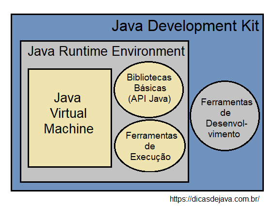

# Aula 01 - Instalação do Java (JDK)
Assista somente ao vídeo equivalente ao seu sistema operacional: 

  1. [Windows XP](https://www.youtube.com/embed/ddhH97IPrFY?start=227&end=809)
  1. [Windows 7](https://www.youtube.com/embed/ddhH97IPrFY?start=819&end=1161)
  1. [Windows 8](https://www.youtube.com/embed/ddhH97IPrFY?start=1180&end=1576)
  1. [Windows 10](https://www.youtube.com/embed/CMHU5buXvNw?start=27&end=583)
  1. [Ubuntu](https://www.youtube.com/embed/BTNp4P12DIs?start=33&end=371)
  1. [MacOS](https://www.youtube.com/embed/xQEauKE4NTw?start=71&end=238)

> É **#fundamental** que você assista ao vídeo e realize as configurações do ambiente Java conforme seu sistema operacional.
---

#### _Material complementar:_

* [Introdução e Dicas para quem está Começando](https://youtu.be/LnORjqZUMIQ)
* [Qual a diferença entre JDK, JRE e JVM ?](https://dicasdejava.com.br/qual-a-diferenca-entre-jdk-jre-e-jvm/)

---

