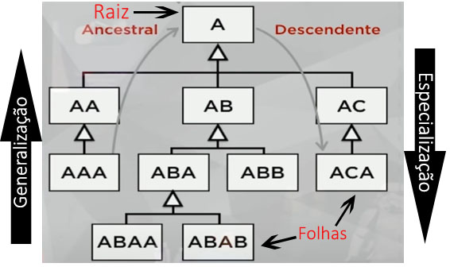

# Aula 09 - Pilares da POO: Herança


Assista aos vídeos: 

  1. [Herança - Parte 1](https://youtu.be/_PZldwo0vVo?t=34)
  1. [Herança na prática com Java - Parte 1](https://youtu.be/19IGAeoFKlU?t=33)
  1. [Herança - Parte 2](https://youtu.be/He887D2WGVw?t=33)
  1. [Herança na prática com Java - Parte 2](https://youtu.be/5pwV2WdD-_Y?t=34)

---
## Herança
Permite basear uma nova classe na definição de outra classe previamente existente. A herança será aplicada tanto para caracteríscicas quanto para comportamentos.

 - **Raiz:** uma classe que não possui superclasses (mãe).
 - **Folha:** uma classe que não possui subclasses (filhas).
 - **Descendente:** A teve um filho AC e AC teve um filho ACA. A é ancestral de ACA. 
 - **A NÃO É ANCESTRAL DE AC**
 - **Ascendente:** ACA é descendente de A.
 - **AC NÃO É DESCENDENTE DE A**
 - **Especialização:** percorrer a árvore de cima pra baixo.
 - **Generalização:** percorrer a árvore de baixo pra cima.

### Herança da Implementação
Apenas herda os atributos e os métodos da classe mãe, sem implementar mais nenhum.

### Herança da Diferença
Herda os atributos e os métodos da classe mãe, implementando outros métodos dela própria.

### Abstrato e final
 - **Classe abstrata:** não pode ser instanciada. Só pode servir como progenitora. (Não pode gerar objetos)
 - **Método abstrato:** declarado, mas não implementado na progenitora. (Interfaces)
 - **Classe final:** não pode ser herdada por outra classe. É obrigatoriamente folha. (Não pode ter filhos)
 - **Método final:** não pode ser sobrescrito pelas suas sub-classes. É obrigatoriamente herdado. (Não pode gerar uma especialização)

## Exercício


O **Yoshi** teve sua primeira aparição na aventura de Mario pelo Mundo dos Dinossauros em Super Mario World. Linguarudo e de fala estranha, o pequeno dinossauro logo se tornou um dos principais parceiros de Mario em suas aventuras pelos mundos mágicos criados pela Nintendo, ajudando e protegendo o nosso herói bigodudo de barriga avantajada. Determinado, corajoso, amigável e positivo, Yoshi sempre está disposto a ajudar seus amigos em qualquer situação. Por diversas vezes salvou sua ilha derrotando o King Bowser Koopa. Quando assume uma tarefa, só pára quando a cumpre por completo. Assim como nosso herói pançudo, Yoshi tem um apetite incrível, mas se restringe a comer frutas (principalmente melão). Com tamanho carisma, Yoshi logo se tornou dos personagens mais queridos e marcantes de toda a franquia Mario.

### Atividade

Baseado nos aprendizados sobre herança vistos nesta aula, vamos tonar o Mario, o Luigi e o Yoshi personagens especializados da classe jogador. Desta forma, passarão a compartilhar dos mesmos atributos e comportamentos da classe jogador, mas terão suas próprias características.

### Nível 1
* Torne a classe `Personagem` abstrata
* Crie a classe `Mario` que extende `Personagem`.
* Crie a classe `Luigi` que extende `Personagem`.
* Crie a classe `Yoshi` que extende `Personagem`.
* Tente instanciar um objetivo do tipo Personagem e veja o que acontece.

### Nível 2
* Para o Mario:
  * Adicione um atributo do tipo Yoshi.
  * Crie um método `montarNoYoshi()` que recebe um Yoshi como parâmetro.
    * Este metodo registra o Yoshi recebido no seu respectivo atributo.
  * Crie um método que imprime se o Mario está montado no Yoshi.
* Para o Luigi
  * Crie um método `voar()` que simplesmente imprime uma mensagem "Luigi está voando".

### Nível 3
* Para o Yoshi:
  * Crie um atributo para registrar a quantidade de frutas que ele come que deve ser inicializado com 0.
  * Crie um atributo para registrar a velocidade que deve ser inicializado com 10;
  * Crie um método `get` para a velocidade.
  * Crie um método `comerFruta()` que acrescenta 1 na quantidade de frutas comidas.
    * A cada 2 frutas, a velocidade do Yoshi dobra.

Por fim, crie uma classe com método `main()`, instancie objetos do Mario, do Luigi, do Yoshi e teste sua implementação.

```java

package aula09_exercicio;

public abstract class Personagem {
    //Atributos
    private String nome;
    private double altura;
    private int idade;
    private int estamina;
    private int quantidadeMoedas;
    private int quantidadeVidas;

    public Personagem(String nome, int idade, double altura) {
        this.nome = nome;
        this.altura = altura;
        this.idade = idade;
        this.estamina = 100;
        this.quantidadeMoedas = 0;
        this.quantidadeVidas = 1;
    }

    //Métodos personalizados
    public void status() {
        System.out.println("----------------------");
        System.out.println("Sobre este Personagem");
        System.out.println("Nome: " + getNome());
        System.out.println("Altura: " + getAltura());
        System.out.println("Idade: " + getIdade());
        System.out.println("Estamina: " + getEstamina());
        System.out.println("Moedas: " + getQuantidadeMoedas());
        System.out.println("Vidas: " + getQuantidadeVidas());
        System.out.println("");
    }

    public void perdeEstamina(int perde) {
        if (this.getEstamina() > perde) {
            this.setEstamina(this.getEstamina() - perde);
            //System.out.println("Perdeu " + perde + " pontos de estamina");
        } else {
            this.setEstamina(0);
            //System.out.println("Está com zero estamina");
        }
    }

    public void ganhaEstamina(int ganha) {
        this.setEstamina(this.getEstamina() + ganha);
        //System.out.println("Ganhou " + ganha + " pontos de estamina");
        if (this.getEstamina() >= 100) {
            setEstamina(100);
        }
    }

    public void crescer(){
        this.setAltura(this.getAltura() * 2);
        //System.out.println("O "+ this.getNome() + " cresceu");
    }

    public void revigorar(){
        this.setEstamina(100);
    }

    public void morrer(){
        this.setEstamina(0);
        if(this.quantidadeVidas > 0){
            this.quantidadeVidas--;
            revigorar();
        }
    }

    public void coletarMoedas(){
        this.quantidadeMoedas++;
        if(this.quantidadeMoedas % 10 == 0){
            this.quantidadeVidas++;
        }

    }

    public void saltar() {
        if (this.getNome() == "Mario"){
            System.out.println(this.getNome() + " pula uma altura de " + this.altura * 0.5);
        }

        if (this.nome.equals("Luigi")){
            System.out.println(this.getNome() + " pula uma altura de " + +this.altura * 2);
        }

        if (this.nome.equals("Yoshi")){
            System.out.println(this.getNome() + " pula uma altura de " + +this.altura * 3);
        }

    }

    //Métodos especiais


    public String getNome() {
        return nome;
    }

    public void setNome(String nome) {
        this.nome = nome;
    }

    public double getAltura() {
        return altura;
    }

    public void setAltura(double altura) {
        this.altura = altura;
    }

    public int getIdade() {
        return idade;
    }

    public void setIdade(int idade) {
        this.idade = idade;
    }

    public int getEstamina() {
        return estamina;
    }

    public void setEstamina(int estamina) {
        this.estamina = estamina;
    }

    public int getQuantidadeMoedas() {
        return quantidadeMoedas;
    }

    public void setQuantidadeMoedas(int quantidadeMoedas) {
        this.quantidadeMoedas = quantidadeMoedas;
    }

    public int getQuantidadeVidas() {
        return quantidadeVidas;
    }

    public void setQuantidadeVidas(int quantidadeVidas) {
        this.quantidadeVidas = quantidadeVidas;
    }
}

 /////////////////////////////

 package aula09_exercicio;

public class Mario extends Personagem{
    private Yoshi yoshi;

    public Mario(String nome, int idade, double altura) {
        super(nome, idade, altura);
    }

    public void montarNoYoshi(Yoshi yoshi){
        this.yoshi = yoshi;
    }

    public void imprimeMontadoYoshi(){
        if(this.yoshi != null){
            System.out.println("Mario está montado no Yoshi");
        }else{
            System.out.println("Mario não está montado no Yoshi");
        }
    }

}


/////////////////////

package aula09_exercicio;

public class Luigi extends Personagem{
    public Luigi(String nome, int idade, double altura) {
        super(nome, idade, altura);
    }

    public void voar(){
        System.out.println("Luigi está voando");
    }
}

////////////////////

package aula09_exercicio;

public class Yoshi extends Personagem{
    private int quantidadeFrutas;
    private int velocidade;

    public void comerFruta(){
        quantidadeFrutas ++;

        if(quantidadeFrutas % 2 == 0){
            velocidade *=2;
        }
    }

    public Yoshi(String nome, int idade, double altura) {
        super(nome, idade, altura);
        this.quantidadeFrutas =0;
        this.velocidade = 10;
    }

    public int getQuantidadeFrutas() {
        return quantidadeFrutas;
    }

    public void setQuantidadeFrutas(int quantidadeFrutas) {
        this.quantidadeFrutas = quantidadeFrutas;
    }

    public int getVelocidade() {
        return velocidade;
    }

    public void setVelocidade(int velocidade) {
        this.velocidade = velocidade;
    }

    @Override
    public String toString() {
        return "Yoshi{" +
                "quantidadeFrutas=" + quantidadeFrutas +
                ", velocidade=" + velocidade +
                '}';
    }

    @Override
    public void status(){
        System.out.println("----------------------");
        System.out.println("Sobre este Personagem");
        System.out.println("Nome: " + getNome());
        System.out.println("Altura: " + getAltura());
        System.out.println("Idade: " + getIdade());
        System.out.println("quantidadeFrutas = " + quantidadeFrutas);
        System.out.println("velocidade = " + velocidade);
    }
}

////////////////////

package aula09_exercicio;

public class Jogando {
    public static void main(String[] args) {
        // Criando o personagem Mario
        Mario mario = new Mario("Mario", 40, 1.60);

        // Criando o personagem Luigi
        Luigi luigi = new Luigi("Luigi", 37, 1.80);

        // Criando o personagem Yoshi
        Yoshi yoshi = new Yoshi("Yoshi", 94, 0.85);

        // Teste para verificar se o Mario monta no Yoshi
        mario.imprimeMontadoYoshi();
        mario.montarNoYoshi(yoshi);
        mario.imprimeMontadoYoshi();

        // Teste para verificar se o Luigi voa
        luigi.voar();

        // Teste para verificar se a velocidade do yoshi aumenta a cada 2 frutas comidas
        System.out.println("Velocidade atual: " + yoshi.getVelocidade());
        yoshi.comerFruta();
        System.out.println("Velocidade atual: " + yoshi.getVelocidade());
        yoshi.comerFruta();
        System.out.println("Velocidade atual: " + yoshi.getVelocidade());
        yoshi.comerFruta();
        yoshi.comerFruta();
        System.out.println("Velocidade atual: " + yoshi.getVelocidade());

    }
}
```
```
Mario não está montado no Yoshi
Mario está montado no Yoshi
Luigi está voando
Velocidade atual: 10
Velocidade atual: 10
Velocidade atual: 20
Velocidade atual: 40
```


